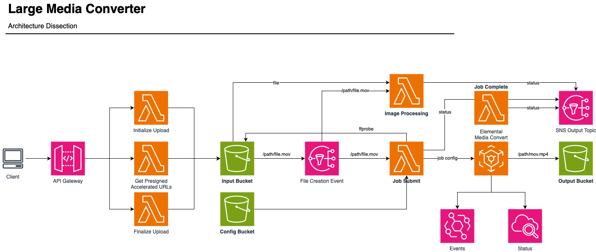
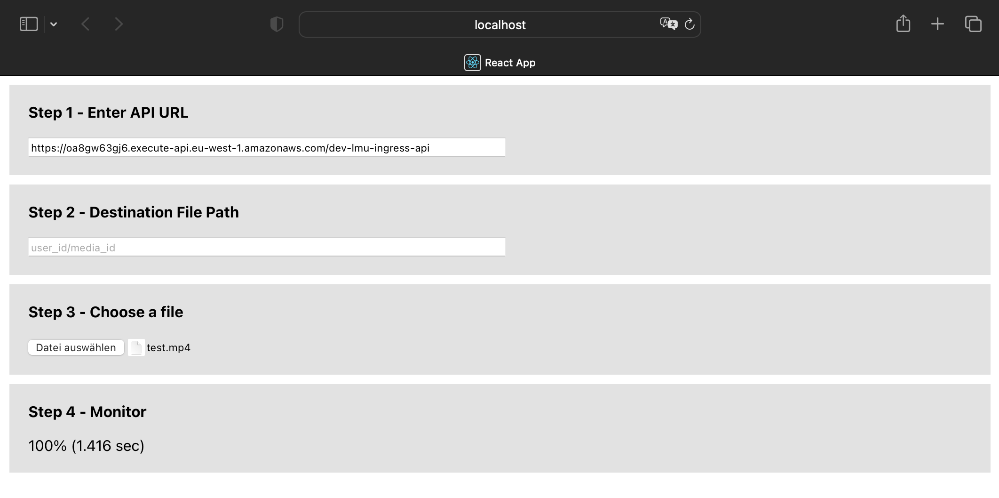

# Large Video Upload and Processing Module

This Terraform module provides a comprehensive solution for uploading, processing, and managing large video files. It enables users to upload large videos via multipart upload to an S3 bucket. The module leverages AWS services like Lambda, S3, MediaConvert, API Gateway, and CloudWatch to automate the video processing workflow.

## Features

- **Multipart Upload**: Supports multipart upload to S3 for handling large video files.
- **Video Processing**: Utilizes AWS Elemental MediaConvert for converting videos into a specified output format.
- **Auto-Scaling**: Automatically scales down videos exceeding a defined size along the longest axis.
- **Notification System**: Integrates with AWS SNS for updates on large media uploads.

## Architecture



## Requirements

- AWS Account with required permissions.
- Terraform installed on your machine.
- AWS CLI configured for access.

## Usage

1. **Initialization**: Run `terraform init` to initialize the module.
2. **Configuration**: Update the `variables.tf` file with your specific configuration.
3. **Deployment**: Execute `terraform apply` to deploy the module resources.

## Resources Created

- AWS Lambda functions for various stages of video processing (submit, complete, initialize, presign, finalize).
- S3 buckets for input and output of media files.
- AWS Elemental MediaConvert for video conversion.
- AWS API Gateway for managing requests.
- AWS CloudWatch for monitoring and triggering events.

## Configuration Variables

- `environment`: Specify the deployment environment (e.g., dev, prod).
- `name`: Name prefix for the AWS resources.
- `mediaconvert_endpoint`: Endpoint for AWS Elemental MediaConvert.
- `video_file_suffixes`: List of supported video file formats.
- `video_max_width` and `video_max_height`: Maximum dimensions for the processed video.
- `output_bucket`: S3 bucket for storing processed videos.

## Outputs

- ARNs for various AWS resources like Lambda functions, S3 buckets, and MediaConvert role.
- URLs and route keys for API Gateway stages.

## Implementation

To implement this service in any pipeline, you must understand multiple components. Processing happens in multiple steps.

### File Upload

The file upload to S3 happens via an API gateway with three endpoints. The `INGRESS_GATEWAY_URL` output of the terraform file designates the API gateway endpoint you need to call. This endpoint has three routes to call:

- `POST /initialize`:
    - The [initialize](lambdas/src/initialize.py) endpoint takes only a single parameter in the body and initializes the upload.
    - **request**
        - `path`: The path and filename of the file to be uploaded. This path is equivalent to the destination path you want the final converted video to be stored at. For example, `/user_id/video_id/my file.mov`.
        - `content_type`: A mime-type specification of what content you are uploading.
    - **response**
        - `file_id`: The id of the file to be uploaded
        - `path`: The path where the file will be stored.
- `POST /presign`
    - The [presign](lambdas/src/presign_urls.py) endpoint takes multiple arguments and produces a number of presigned URLs to upload the multiple fileparts with.
    - **request**
        - `path`: The path and filename of the file to be uploaded. This path is equivalent to the destination path you want the final converted video to be stored at. For example, `/user_id/video_id/my file.mov`.
        - `file_id`: The id of the file to be uploaded. Received from `/initialize`
        - `parts`: The number of unique parts the file is split into for uploading.
    - **response**
        - `parts`: A list of dictionaries containing both a `signedUrl` and a `PartNumber`.
- `POST /finalize`
    - The [finalize](lambdas/src/finalize.py) endpoint needs to be called **after** all parts have been uploaded using the presigned URLs. This finalizes the upload and kicks the video conversion off. Unfinished multipart uploads expire after a day.
    - For more details, please check: https://boto3.amazonaws.com/v1/documentation/api/latest/reference/services/s3/client/complete_multipart_upload.html
    - **request**
        - `path`: The path and filename of the file to be uploaded. This path is equivalent to the destination path you want the final converted video to be stored at. For example, `/user_id/video_id/my file.mov`.
        - `file_id`: The id of the file to be uploaded. Received from `/initialize`
        - `parts`: A list of dictionaries containing at least one element. This parts dictionary must contain the keys:
            - `PartNumber`: The int number of the part.
            - `ETag`: The etag of the uploaded file.
    - **response**:
        - `message`: A boolean confirmation of the upload.

#### Remarks

Note that this module has inconsistent code style, because we switch between camel case (AWS) and snake case (Python).

#### Responses

We only support three responses:
- `200`: Allright
- `400`: Your input failed the validation (wrong file format, folder, ...)
- `500`: Something unexpected happened

#### Sample Implementation

The folder [examples](examples/) includes a sample frontend application. To test the integration, check out the code base.

The primary upload and file splitting code resides in [upload.js](examples/frontend/src/utils/upload.js)

This frontend looks like this:



### Conversion Results

After the file has been uploaded some time may pass. During this time you need to actively listen to the returned SNS Topic ARN from the terraform module. Example:

```bash
video_complete_sns_topic_arn = "arn:aws:sns:eu-west-1:509069223821:dev-lmu-large-media-upload-updates"
```

This topic receives all status updated from the video conversion pipeline after uploading a media object. The logic for this lambda resides in the [complete_video](lambdas/src/complete_video.py) lambda. It receives input from the job preprocessing and clound watch sending SNS events.

The messages you receive always look like this:

```python
class SNSMessage(BaseModel):
    """SNS Message."""

    status: int = 200
    subject: str
    data: dict = {}


class SNSError(SNSMessage):
    """SNS Error."""

    status: int = 500
    subject: str = "ERROR"
    detail: str
    error: str
```

A successfull conversion will return a JSON via SNS that looks like this:

```json
{
    "status": 200,
    "subject": "COMPLETE",
    "data": {
        "Id": "1701103219288-mu5mk8",
        "Job": {...},
        "OutputGroupDetails": [...],
        "OutputFile": "s3://dev-lmu-media-output-bucket/test.mp4",
        "InputFile": "s3://dev-lmu-media-input-bucket/test.mp4",
        "PathElements": [
            "dev-lmu-media-input-bucket",
            "test.mp4"
        ]
    }
}
```

If the video was converted successfully it will be placed in the output bucket defined in [variables.tf](variables.tf).


## Development Flow

To develop this module you need to have:

- Access to a playground organization
- A `state.tf` file which looks similar:

```terraform
terraform {
  backend "s3" {
    bucket  = "your-bucket-name"
    key     = "terraform"
    region  = "eu-west-1"
    encrypt = true
  }
}

provider "aws" {
  region = "eu-west-1"
}
```

- A `variables.tfvars` which contains the mediaconvert endpoint:

```
mediaconvert_endpoint = "https://sipdnapsdnp.mediaconvert.eu-west-1.amazonaws.com"
```

you can get this via your AWS console.

Then you can deploy using the usual terraform commands and develop.

## Docker Images

Note that this repo comes with two different docker images. 
- [Lambda](lambdas/Dockerfile) is for building a lightweight lambda container based on AWS base image
- [CI](Dockerfile) is for the CI/CD and unittests with linting.

When adding a runtime dependency, add them to both.